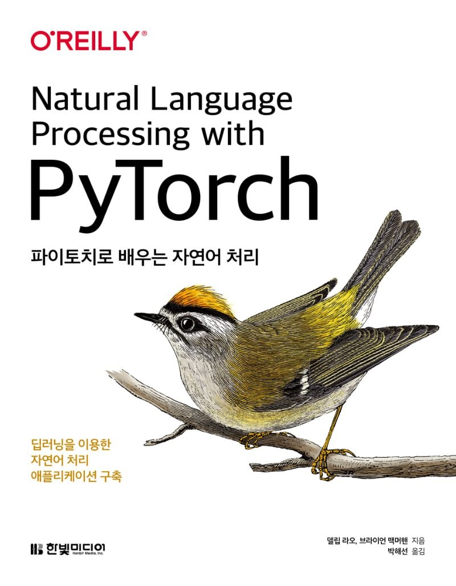

# 파이토치로 배우는 자연어 처리

이 책은 델립 라오(Delip Rao), 브라이언 맥머핸(Brian McMahan)이 지은 [Natural Language Processing with PyTorch](https://www.amazon.com/Natural-Language-Processing-PyTorch-Applications/dp/1491978236/)의 번역서입니다.

에러타는 [블로그](https://tensorflow.blog/nlp-with-pytorch/)를 참고해 주세요. 이 책의 코드는 최신 사이킷런, 파이토치를 사용하며 구글 코랩(Colab)을 사용해 무료로 실행할 수 있습니다.

Table of Contents
=================

<!--ts-->
* [1장: 소개](https://github.com/rickiepark/nlp-with-pytorch/tree/main/chapter_1)
  * 파이토치 기초
* 2장: NLP 기술 빠르게 훑어보기
* [3장: 신경망의 기본 구성 요소](https://github.com/rickiepark/nlp-with-pytorch/tree/main/chapter_3)
  * 퍼셉트론: 가장 간단한 신경망
  * 지도 학습 훈련 알아보기
  * 예제: 레스토랑 리뷰 감성 분류하기
* [4장: 자연어 처리를 위한 피드 포워드 신경망](https://github.com/rickiepark/nlp-with-pytorch/tree/main/chapter_4)
  * 퍼셉트론의 한계
  * MLP 소개
  * CNN 소개
  * MLP로 성씨 분류하기
  * CNN으로 성씨 분류하기
* [5장: 단어와 타입 임베딩](https://github.com/rickiepark/nlp-with-pytorch/tree/main/chapter_5)
  * 사전 훈련된 임베딩 사용하기
  * CBOW 임베딩 학습하기
  * 사전 훈련 임베딩을 사용한 전이 학습
* [6장: 자연어 처리를 위한 시퀀스 모델링 - 초급](https://github.com/rickiepark/nlp-with-pytorch/tree/main/chapter_6)
  * 시퀀스 표현
* [7장: 자연어 처리를 위한 시퀀스 모델링 - 중급](https://github.com/rickiepark/nlp-with-pytorch/tree/main/chapter_7)
  * 시퀀스 표현에서 새로운 성씨 생성하기
  * 조건없는 생성
  * 조건부 생성
* [8장: 자연어 처리를 위한 시퀀스 모델링 - 고급](https://github.com/rickiepark/nlp-with-pytorch/tree/main/chapter_8)
  * PackedSequences 이해하기
  * 시퀀스 투 시퀀스 모델링
  * 어텐션
  * 신경망 기계 번역
* 9장: 고전 모델, 최신 모델, 더 배울 것들
<!--te-->
